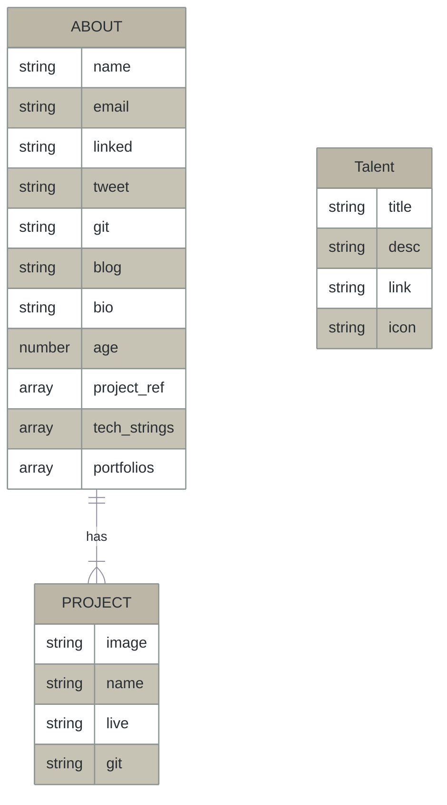

# RESTful API 

**Summary**
| Field | Detail |
|-------|--------|
| Project Name | Portfolio API|
| Description | Relevant information on Kyle Canamar, to create various portfolios with front end frameworks. |
| Developers | Kyle Canamar |
| Live Website | https://portfolio-api-dr2t.onrender.com/ |
| Repo | https://github.com/kcanamar/portfolio-API |
| Technologies | Node.JS, Express.JS, JavaScript |

## Routing Table

| Endpoint | Method | Response | Other |
| -------- | ------ | -------- | ----- |
| /api/projects | GET | JSON of all projects | |
| /api/projects/:id | GET | JSON of one project | |
| /api/about | GET | JSON of all about versions | |
| /api/about/:id | GET | JSON of one about version | |
| /api/talents | GET | JSON of one all talents | |
| /api/talents/:id | GET | JSON of one talent version | |

## ERD 

